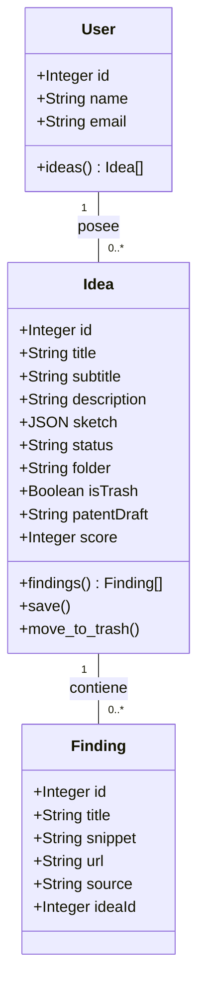

# Arquitectura del Sistema - Idea Pipeline

Este documento describe la arquitectura técnica, el flujo de datos y el modelo del sistema del Generador de Ideas.

## Visión General

El sistema sigue una arquitectura cliente-servidor tradicional, potenciada por una capa de "Agentes" que orquestan las interacciones con APIs de Inteligencia Artificial.

### Componentes Principales

1.  **Frontend (React)**: Interfaz de usuario reactiva que maneja el flujo de creación (Boceto -> Investigación -> Selección -> Generación).
2.  **API Server (Express)**: Punto central de control que gestiona la persistencia en DB y el sistema de archivos local.
3.  **Capa de Agentes**: Módulos especializados (`researcher`, `generator`, `evaluator`) que encapsulan la lógica de IA.
4.  **Almacenamiento**:
    *   **PostgreSQL**: Datos estructurados (Ideas, Hallazgos, Usuarios).
    *   **Local Storage**: Archivos binarios (Imágenes, Videos) organizados por `/storage/{userId}/{ideaId}/`.

## Diagrama de Clases (Mermaid)

Para visualizar este diagrama, se recomienda usar la extensión **Markdown Mermaid** en VS Code o visualizarlo en GitHub. Mermaid es una alternativa moderna a PlantUML que se integra nativamente en Markdown.



## Flujo de Datos de IA

1.  **Investigación**: El `researcher` utiliza `duck-duck-scrape` para extraer snippets de la web.
2.  **Generación de Ideas**: El `generator` envía los hallazgos seleccionados y el contexto a **Gemini 2.0 Flash**.
3.  **Redacción de Patentes**: Se utiliza un agente especializado con un prompt de "Patent Attorney" para generar el `patentDraft`.
4.  **Generación Visual**: 
    *   Fase 1: Gemini genera un "Visual Prompt" técnico.
    *   Fase 2: El servidor descarga la imagen desde **Pollinations.ai (Flux)** y la persiste localmente.

## Estructura de Carpetas Local

```text
/server/storage
  /{userId}
    /{ideaId}
      /images  <-- Imágenes subidas y generadas por IA
      /videos  <-- Videos de simulación o demostración
      metadata.json <-- Copia de seguridad del estado
```
