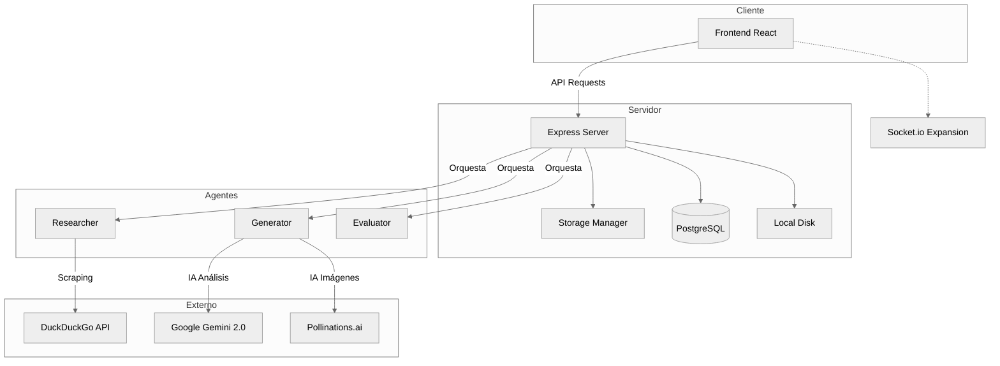

# Diagrama de Componentes - Idea Pipeline

Este diagrama detalla la interacción entre los diferentes módulos y capas del sistema.

## Descripción de Componentes

### 1. Frontend (React + Vite)
*   **UI Components**: Manejan la experiencia de usuario artesanal (Canvas, Fichas).
*   **State Management**: Controla el flujo de vistas y la carga de ideas en memoria.

### 2. Express Server (Node.js)
*   **Routes**: Endpoints para CRUD de ideas y disparadores de IA.
*   **Storage Manager**: Encapsula la lógica de guardado de archivos y miniaturas.

### 3. Capa de Agentes (Lógica de IA)
*   **Researcher**: Orquesta búsquedas web y parseo de HTML.
*   **Generator**: Transforma texto plano en estructuras JSON ricas y redacta documentos técnicos.
*   **Evaluator**: Módulo matemático y de IA para asignar puntajes de mercado.

### 4. Proveedores Externos
*   **Google Gemini**: El cerebro lingüístico detrás de las ideas y patentes.
*   **Pollinations.ai**: Motor de síntesis de imagen para prototipado visual rápido.
